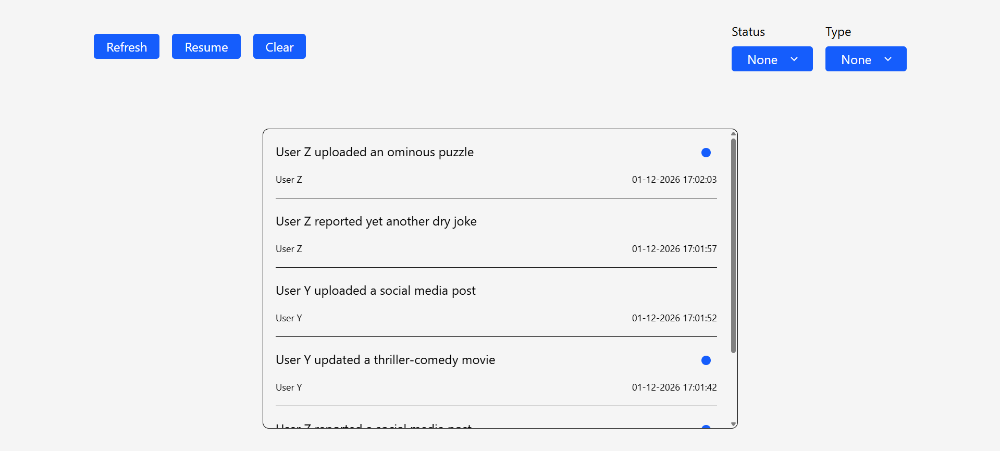

# Activity Log


A real-time activity log that features:
- a custom activity API (with network simulation)
- API polling with refresh, pause, and resume controls
<!--- full test coverage (unit, integration, "happy path" E2E)-->
- clean transitions and animations with Framer Motion

## Table of Contents
1. [Installation](#installation)
2. [Usage](#usage)
3. [Tech Stack](#tech-stack)
4. [Author](#author)
5. [License](#license)

## Installation
Type in the following commands in the terminal (Replace &lt;target&gt; with the actual target directory):
```
cd <target>
git clone https://github.com/logicalPanda2/activity-log-project.git
npm install
```

## Usage
Type in the following commands:
```
cd event-log-project
npm run dev
```
Then, click `o + Enter`.

## Tech Stack
- React.js
- Tailwind CSS
- Framer Motion
- Vitest
- TypeScript
- and HTML, CSS, JS

## Author
Marcelino Romeo (https://github.com/logicalPanda2)

## License
This project is licensed under the <a href="./LICENSE.txt">MIT License</a>.